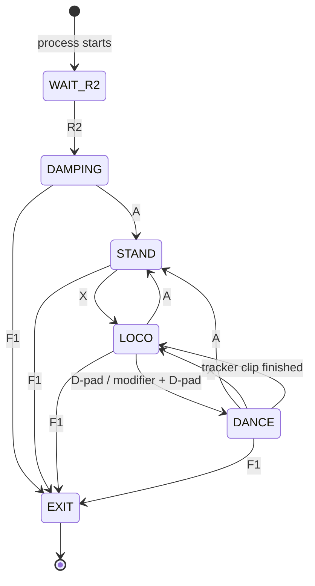

We provide a real-world deployment framework for the specialist and generalist tracker policies. The framework is built upon [unitree_sdk2](https://github.com/unitreerobotics/unitree_sdk2). 


# Data preparation

- Process motion data into ONNX files.
  
  ```shell
  python scripts/process_motion/convert_motion_npz2onnx.py
  ```

- Place AnyTracker policies into `deploy/storage/policy` directories.

  We have open-sourced 8 specialists and 1 generalist policy [here](https://drive.google.com/drive/folders/1wDL4Chr6sGQiCx1tbvhf9DowN73cP_PF?usp=drive_link) for you to deploy. If you want to deploy your own policies, please refer to [Deploy your own policies](#deploy-your-own-policies) section below.

The final directory structure of `deploy/storage` should be:

```
deploy/
└── storage/
    ├── data/
    │   ├── dance1_subject1/
    │   │   └── ref_data.onnx
    │   ├── .../                          # 40 LAFAN1 motions (each folder has ref_data.onnx)
    │   └── walk4_subject1/
    │       └── ref_data.onnx
    ├── g1_tracking_constant.yaml
    └── policy/
        ├── 05122021_G1TrackingGeneralDR_new_specialist8/
        │   ├── checkpoints/
        │   └── info.log
        ├── .../                          # 8 specialist policies (same layout as above)
        ├── 05151715_G1TrackingGeneralDR_new_specialist1/
        │   ├── checkpoints/
        │   └── info.log
        ├── G1-Walk.onnx
        └── general_tracker_lafan1_v2/
            └── checkpoints/
```

# Installation

**Note:** Copy the entire `deploy` directory to your Unitree G1 robot. All the following steps should be done on the Unitree G1 robot.

```bash
wget https://github.com/microsoft/onnxruntime/releases/download/v1.19.2/onnxruntime-linux-aarch64-1.19.2.tgz 
sudo tar -xzf onnxruntime-linux-aarch64-1.19.2.tgz --strip-components=1 -C /usr/local/  --wildcards '*/lib/*' '*/include/*'  
sudo ldconfig  
ls /usr/local/include/onnxruntime*  # Check header files  
ls /usr/local/lib/libonnxruntime*  # Check library files

sudo apt update  
sudo apt install libeigen3-dev libyaml-cpp-dev libgtest-dev  

wget https://github.com/google/glog/archive/refs/tags/v0.6.0.zip
unzip v0.6.0.zip
cd glog-0.6.0
mkdir build
cd build
cmake -DBUILD_TESTING=OFF ..
make -j
sudo make install
```

You can also use the pre-downloaded files we provided in `deploy/download` to install the dependencies.

# Usage

## Framework design

The deployment controller is organized as a state machine with four states: `DAMPING` is the initial safe state after the control loop starts, `STAND` brings the robot to a standing pose, `LOCO` runs a simple walking policy, and `DANCE` runs one selected tracker policy. The Unitree remote controll is used to start the control loop, switch between these states, select tracker motions, and stop the process.

The usual operating sequence is:

1. Start the process and wait for the `Press R2 to start!` prompt.
2. Press `R2` once to start the control loop. The controller enters `DAMPING` first.
3. Press `A` to enter `STAND`.
4. Press `X` to enter `LOCO`.
5. In `LOCO`, use the D-pad and modifier combinations to select a tracker motion.

The full state machine logic is as follows:



Unitree remote controll key bindings:

| Button | Function |
|---|---|
| `R2` before startup | Start the low-level control loop |
| `A` | Switch to `STAND` |
| `X` | Switch to `LOCO` |
| `F1` | Terminate the deployment process |
| `B` | Cycle the tracker group: specialist motions 1-20, specialist motions 21-40, generalist motions 1-20, generalist motions 21-40 |
| D-pad | Tracker slots 0-3 |
| `L1` + D-pad | Tracker slots 4-7 |
| `R1` + D-pad | Tracker slots 8-11 |
| `L2` + D-pad | Tracker slots 12-15 |
| `R2` + D-pad | Tracker slots 16-19 |

In `DANCE`, the selected tracker depends on the current tracker group and the D-pad slot. The `B` button cycles the group in this order:

1. Specialist motions 1-20
2. Specialist motions 21-40
3. Generalist motions 1-20
4. Generalist motions 21-40

We list the policy checkpoint and reference motion corresponding to each tracker slot in the table [] for quick reference when operating the remote.


## Build modes

We provided 2 build modes:

- `build_wo_torque_projection.sh` compiles the controller with dance torque projection disabled. The tracker directly outputs desired joint positions, and the low-level PD controller produces the final torque.
- `build_w_torque_projection.sh` compiles the controller with dance torque projection enabled. During tracker execution, the deployment code reconstructs the requested PD torque, clips it using the torque limits in `storage/g1_tracking_constant.yaml`, and projects the clipped torque back to an adjusted desired joint position.

We provide this second mode because torque clipping was used during policy training. The projection mode makes real-world tracker execution closer to the training-time torque-limited dynamics.

## Test deployment APIs in MuJoCo simulation

This section describes how to test the deployment API in MuJoCo simulation before running on the real robot, for quicker iteration and safety validation. The MuJoCo simulation uses the same C++ control code as the real-world deployment, but replaces the Unitree remote control with keyboard inputs and simulates the robot dynamics in MuJoCo instead of the real world.

**Note:** All the following steps should be done on your local machine.

### Install dependencies

1. Install all dependencies on your local machine following [Installation](#installation) section.
2. Create a python virtual environment `OpenTrack_deploy` and install `unitree_sdk2py` following [unitree_sdk2py](https://github.com/unitreerobotics/unitree_sdk2_python) repository.
3. Install MuJoCo `mujoco==3.3.1`.

### MuJoCo test

The MuJoCo test uses two processes connected by CycloneDDS over the loopback interface:

| Process | Role |
|---|---|
| `sim_interface/main.py` | Runs the MuJoCo G1, publishes robot state, and listens to control commands |
| `build/bin/state_machine_example` | Runs the same C++ deployment controller used on the real robot |

1. Open two terminals.

    - Terminal A starts the virtual robot:

        ```shell
        cd sim_interface
        conda activate OpenTrack_deploy
        python main.py --iface lo
        ```

    - Terminal B builds and starts the deployment controller:

        ```shell
        cd G1_deploy
        ./build_wo_torque_projection.sh
        ./start_sim_wo_torque_projection.sh --iface lo
        ```

        or, for the torque projection mode:

        ```shell
        cd G1_deploy
        ./build_w_torque_projection.sh
        ./start_sim_w_torque_projection.sh --iface lo
        ```

2. Start playing with the robot in MuJoCo simulation.


    Simulation keyboard bindings:

    | Keyboard key | Unitree remote control button |
    |---|---|
    | `1`, `2`, `3`, `4` | `L1`, `L2`, `R1`, `R2` |
    | `5`, `6`, `7`, `8` | `Select`, `F1`, `F3`, `Start` |
    | `a`, `b`, `x`, `y` | `A`, `B`, `X`, `Y` |
    | Arrow keys | D-pad |
    | `i`, `k`, `j`, `l`, `u`, `o` | Stick inputs |
    | `F5`, ``, `` ` `` | Start physics simulation |
    | `F8`, `End`, `r` | Reset the MuJoCo robot pose |

The recommended manual workflow is:

1. Start Terminal A. The simulated robot is pinned at the default standing pose and physics is not stepping yet.
2. Start Terminal B. The deployment controller waits for `R2`.
3. Press `4` to send `R2` and start the C++ control loop.
4. Press `a` to enter `STAND`.
5. Press `x` to enter `LOCO`.
6. Press `F5` to send `SimStart` and enable MuJoCo physics stepping.
7. Use the D-pad keys, optionally with `1`/`2`/`3`/`4` as `L1`/`L2`/`R1`/`R2` modifiers, to trigger tracker motions.

## Real world deployment

**Note:** All the following steps should be done on the Unitree G1 robot.

1. Install all dependencies on your Unitree G1 robot following [Installation](#installation) section.
2. Run the deployment script:

    ```shell
    ./build_w_torque_projection.sh
    ./start_deploy_w_torque_projection.sh
    ```

   or:

   ```shell
   ./build_wo_torque_projection.sh
   ./start_deploy_wo_torque_projection.sh
   ```

3. Operate the robot with the Unitree remote. Refer to [General introduction](#general-introduction) section for the key bindings and state machine logic.

## Deploy your own policies

To deploy a new tracker policy, prepare the policy checkpoint as follows:

1. Put the policy directory under `storage/policy/`.

2. Edit `state_machine/robot_controller.hpp` to bind the policy and motion name to a tracker slot.

    To replace one of the built-in motions, update the corresponding entry in the `motion_bindings` table:

    ```cpp
    {"<policy_name>", "<data_name>"},
    ```

    To replace the generalist policy used by mode groups 2 and 3, update:

    ```cpp
    static constexpr const char *kGeneralistPolicy = "<policy_name>";
    ```

3. Rebuild the deployment executable before running.

    ```shell
    ./build_wo_torque_projection.sh
    # or
    ./build_w_torque_projection.sh
    ```

4. Validate the new policy in MuJoCo first with `start_sim_*.sh`. After the sim run is stable, copy the same `storage/` assets to the robot, rebuild, and run the corresponding `start_deploy_*.sh` script.