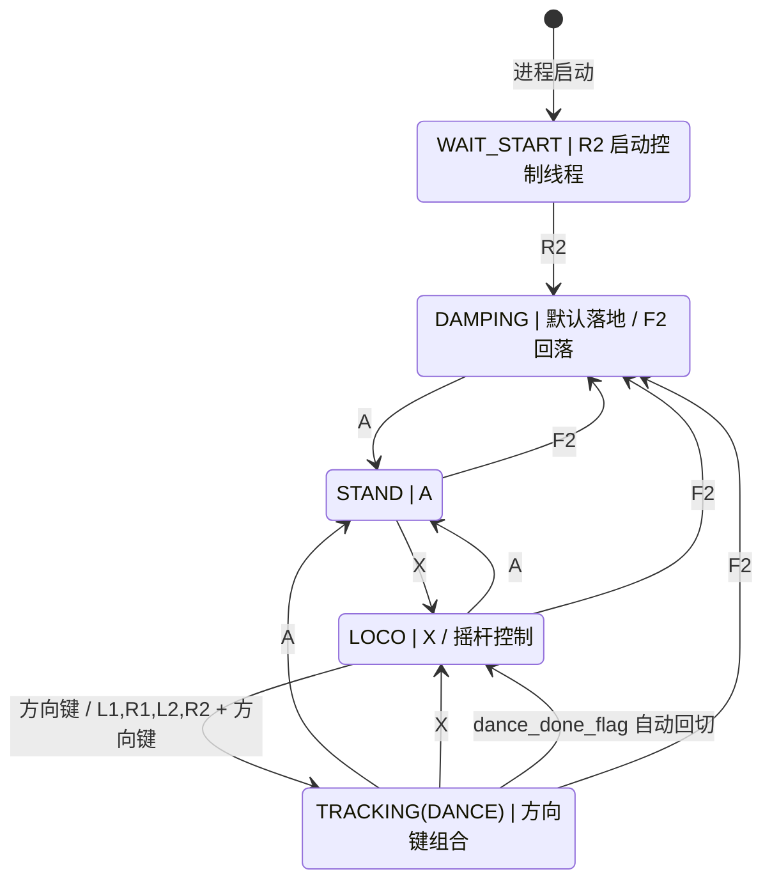
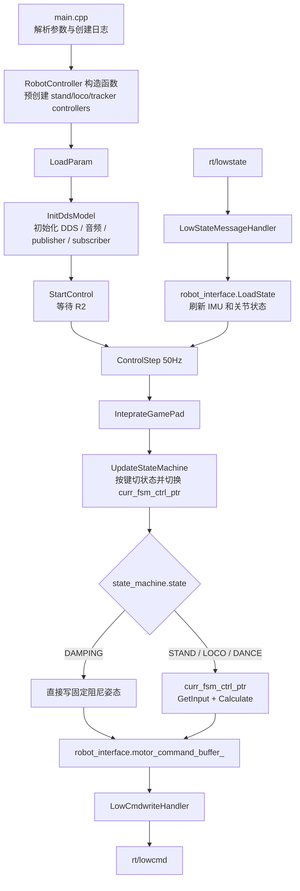
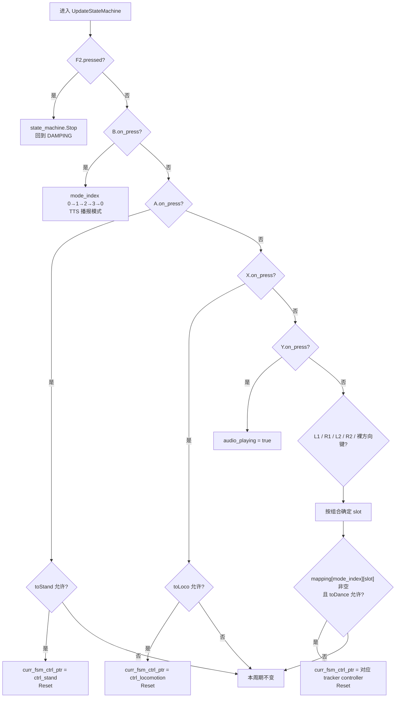
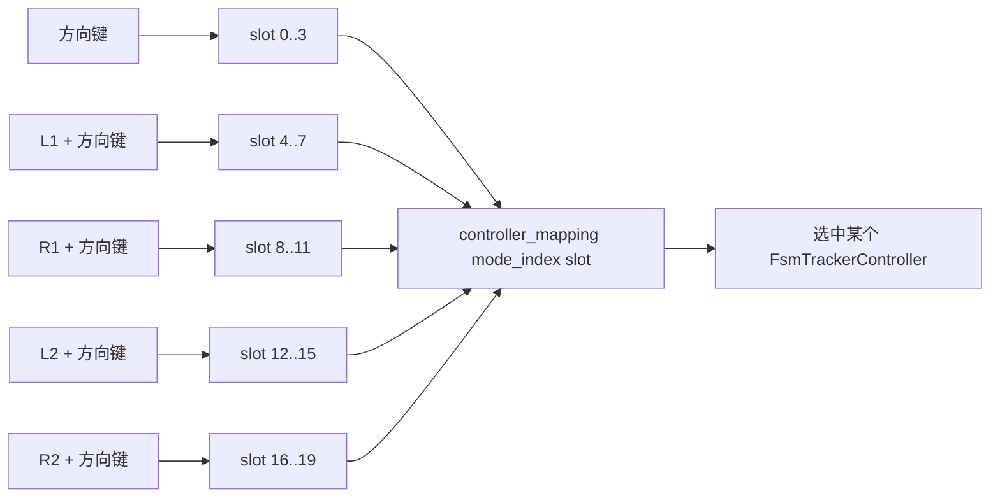

# G1_deploy 状态机说明（2026-05-19）

这份 README_260519 先只写第一节，专门把 `state_machine/` 这套控制外壳里的状态机形态讲清楚。它承接 `README_260518.md` 的结论，但把关注点进一步收窄到两个问题：

1. 运行时真正存在的状态到底有哪些，按键怎么把它们串起来。
2. `state_machine/` 下这些文件，是如何一起把这张状态机图“落地”为可运行控制链路的。

---

## 1. 状态机形态：它其实是“枚举状态 + 控制器指针 + 按键映射表”

如果只看 `state_machine/state_machine.hpp`，会以为这里的状态机非常简单，因为它只暴露了 4 个枚举状态：

1. `DAMPING`
2. `STAND`
3. `DANCE`
4. `LOCO`

但真实运行时，状态机并不是“一个枚举 + 一个 switch”这么简单，而是由下面 3 层一起组成的：

1. `SimpleStateMachine` 负责约束“允许怎么跳”。
2. `RobotController::UpdateStateMachine()` 负责把手柄按键翻译成状态切换，并同步切换 `curr_fsm_ctrl_ptr`。
3. `curr_fsm_ctrl_ptr` 指向的具体 controller，才真正决定这个周期输出什么 `jpos_des/kp/kd`。

所以，最准确的理解方式是：

```text
状态机 = 合法迁移关系 + 当前控制器指针 + 一张 4 x 20 的 tracking 按键映射表
```

其中有一个非常关键但容易看错的点：

1. 代码里的枚举名叫 `DANCE`。
2. 但在实现层，它实际承载的是“所有 tracking 动作片段”的统一入口。
3. 也就是说，这个节点不是单个舞蹈状态，而是很多个 `FsmTrackerController` 实例的统称。

## 1.1 先看整体图

下面这张图，把代码里的真实切换关系压缩成了一个可读的 Mermaid 状态图。



这张图里有 4 个实现层面的关键信息。

1. `WAIT_START` 不是 `SimpleStateMachine` 的枚举状态，而是 `RobotController::StartControl()` 在真正启动控制线程之前的人机门禁阶段，只有按下 `R2` 才会开始周期控制。
2. `DAMPING` 是默认入口，也是全局回落态。无论当前处于 `STAND`、`LOCO` 还是 `TRACKING(DANCE)`，按下 `F2` 都会回到这个阻尼状态。
3. `TRACKING(DANCE)` 只能从 `LOCO` 进入，因为 `SimpleStateMachine::toDance()` 只允许 `LOCO -> DANCE`。
4. tracking 结束后不会停在原地，而是由 `dance_done_flag` 触发自动回切到 `LOCO`。

因此，如果只问“这套状态机的骨架是什么”，最短的答案其实是：

```text
R2 启动控制线程
  -> 默认先落在 DAMPING
  -> A 进入 STAND
  -> X 进入 LOCO
  -> 方向键组合从 LOCO 进入 TRACKING(DANCE)
  -> tracking 结束后自动回到 LOCO
```

## 1.2 节点上的按键，到底在代码里是什么意思

上图把“按键和状态”的主干关系画出来了，但这里还要补充 4 个实现细节，否则很容易把按键理解偏。

### 1. `B` 不是状态跳转键，而是 tracking 模式组切换键

`B` 不会改动 `state_machine.state`。

它只会让 `mode_index` 在下面 4 组之间轮换：

1. 普通模式
2. 抗扰动模式
3. 地形模式
4. 基线模式

也就是说，`B` 决定的是“同一套方向键组合，最后会选中哪一组 `FsmTrackerController`”，而不是“机器人当前处于哪个状态”。

### 2. tracking 节点虽然只画成 1 个 node，但内部其实是一张大映射表

`robot_controller.hpp` 里有一张 `controller_mapping[4][20]`，它的含义是：

1. 第 1 维 `4` 对应 4 个 `mode_index` 模式组。
2. 第 2 维 `20` 对应 20 个按键槽位。

这 20 个槽位和按键的关系是：

| 槽位范围 | 触发按键 |
| --- | --- |
| `0` 到 `3` | `上 / 下 / 左 / 右` |
| `4` 到 `7` | `L1 + 上 / 下 / 左 / 右` |
| `8` 到 `11` | `R1 + 上 / 下 / 左 / 右` |
| `12` 到 `15` | `L2 + 上 / 下 / 左 / 右` |
| `16` 到 `19` | `R2 + 上 / 下 / 左 / 右` |

所以 Mermaid 图里那个 `TRACKING(DANCE)` 节点，在实现层并不是一个 controller，而是：

1. 先由 `mode_index` 选中一组。
2. 再由方向键组合选中这一组里的某个槽位。
3. 最后把对应的 `FsmTrackerController *` 挂到 `curr_fsm_ctrl_ptr` 上。

### 3. `R2` 在这套工程里有双重含义

`R2` 有两个完全不同的使用位置：

1. 在 `StartControl()` 里，`R2.on_press` 是“启动控制线程”的门禁键。
2. 在 `UpdateStateMachine()` 里，`R2.pressed + 方向键` 又是 tracking 的第 5 组槽位选择键。

所以读代码时不能简单把 `R2` 理解成单一功能键，而要先看它出现在“启动前的等待循环”还是“已经进入控制周期后的按键分发”。

### 4. 还有 3 个按键属于旁路功能，不属于状态节点

还有 3 个按键经常会被误判为状态机的一部分，但严格说它们不是：

1. `Y`：只把 `audio_playing = true`，用于触发音频播放。
2. `F1`：设置 `stop_requested_ = true`，用于退出程序。
3. `F2`：是真正的回落键；代码注释写的是“L2 + B -> Stop”，但当前实现实际检测的是 `F2.pressed`。

## 1.3 各个文件是如何协同构造这个状态机的

如果把状态机当成一条完整控制链路，那么 `state_machine/` 下几个关键文件的分工可以按下面顺序理解。

### 1. `state_machine/main.cpp` 负责把整套外壳拉起来

它只做 4 件事：

1. 初始化日志目录。
2. 创建 `RobotController`。
3. 调用 `LoadParam()` 和 `InitDdsModel()`。
4. 最后进入 `StartControl()`。

也就是说，`main.cpp` 不决定状态机怎么跳，它只是把“状态机宿主对象”拉起来。

### 2. `state_machine/gamepad.hpp` 负责把无线手柄原始字节流解释成按键事件

这里定义了：

1. 原始遥控器字节布局 `REMOTE_DATA_RX`。
2. 带有 `pressed / on_press / on_release` 语义的 `Button`。
3. 聚合所有按钮与摇杆轴的 `Gamepad`。

这一步非常关键，因为 `UpdateStateMachine()` 依赖的不是原始字节，而是：

1. 边沿触发语义，例如 `A.on_press`、`X.on_press`。
2. 持续按住语义，例如 `L1.pressed`、`R2.pressed`。

没有这层封装，后面的状态跳转逻辑会非常难写。

### 3. `state_machine/state_machine.hpp` 负责定义“允许跳转”的最小骨架

这里的 `SimpleStateMachine` 很克制，只做一件事：

1. `Stop()`：回到 `DAMPING`
2. `toStand()`：允许 `DAMPING / DANCE / LOCO -> STAND`
3. `toLoco()`：允许 `STAND / DANCE -> LOCO`
4. `toDance()`：只允许 `LOCO -> DANCE`

这意味着：

1. `STAND` 不能直接进 `DANCE`
2. 一个 tracking clip 运行时，不能直接切到另一个 tracking clip
3. 想重新选 tracking，必须先回到 `LOCO`

所以这份文件虽然很短，但它其实定义了整张图最重要的约束边界。

### 4. `state_machine/fsm_basic_controller.hpp` 负责给所有非阻尼状态提供统一接口

`DAMPING` 是 `ControlStep()` 里单独写死的一条分支。

而 `STAND / LOCO / DANCE` 这 3 类状态，则统一遵守 `BasicUserController` 接口：

1. `Reset()`
2. `GetInput()`
3. `Calculate()`
4. `GetLog()`

这层抽象的作用，是让 `RobotController` 不需要知道“当前是站立插值、walking policy 还是 tracking policy”，它只需要调用统一接口即可。

### 5. `state_machine/fsm_stand_controller.cpp`、`fsm_loco_controller.cpp`、`fsm_tracker_controller.hpp/.cpp` 负责把 node 变成具体动作源

它们分别对应 Mermaid 图里的 3 个非阻尼节点：

1. `FsmStandController`
   1. 从 `state_machine/params/stand.json` 读取 `init_pos/kp/kd`
   2. 做一个从当前姿态插值到默认站姿的短时过渡
2. `FsmLocoController`
   1. 从手柄摇杆读取速度指令
   2. 运行 `G1-Walk.onnx`
   3. 产出 walking 的目标关节角
3. `FsmTrackerController`
   1. 在构造时定位某个 tracking policy 的 `policy.onnx`
   2. 在 `Reset()` 里加载 `ref_data.onnx` 和 YAML 常量
   3. 在 `Calculate()` 里输出一段参考动作对应的目标关节角
   4. 在片段结束时把 `dance_done_flag` 置为 `true`

也就是说，Mermaid 图里的每个 node，最后都要落成一个具体 controller；只是 `TRACKING(DANCE)` 这个 node 会根据按键，动态指向很多不同的 `FsmTrackerController` 实例。

### 6. `state_machine/robot_interface.hpp` 负责把“状态机输出”真正接到 DDS 命令通道上

它做的是状态机的“输入输出桥”：

1. `LoadState()`：把 `rt/lowstate` 里收到的 IMU、关节位置、关节速度写进缓冲区。
2. `GetLowCmd()`：把当前 controller 写好的 `MotorCommand` 打包成 `LowCmd_`。

因此，controller 只需要面向 `RobotInterface` 的缓冲区编程，不需要自己处理 DDS 消息细节。

### 7. `state_machine/robot_controller.hpp` 才是真正把前面所有文件“缝起来”的地方

如果只允许看一个文件，那就应该先看它，因为真正把状态机拼装完成的就是这里。

它主要做了 5 件事：

1. 在构造函数里预创建 `FsmStandController`、`FsmLocoController`，以及大批量 `FsmTrackerController`，并把它们放进 `controller_mapping`。
2. 在 `InitDdsModel()` 里创建 DDS publisher/subscriber，并释放机器人现有模式控制权。
3. 在 `InteprateGamePad()` 里把无线遥控数据更新成 `Gamepad` 状态。
4. 在 `UpdateStateMachine()` 里根据按键更新 `state_machine.state`，同时切换 `curr_fsm_ctrl_ptr`。
5. 在 `ControlStep()` 里根据当前状态执行 controller，最后调用 `LowCmdwriteHandler()` 把命令发到 `rt/lowcmd`。

所以从工程结构上说：

```text
state_machine.hpp 负责“这条边能不能走”
robot_controller.hpp 负责“什么时候走这条边，以及走过去后接哪个 controller”
fsm_*.cpp 负责“走到这个 node 之后具体输出什么动作”
robot_interface.hpp 负责“把动作写回 DDS”
```

## 1.4 从 `main.cpp` 出发看实际运行流程

与其把这套状态机理解成“某个头文件里的枚举”，不如直接顺着程序真实调用顺序来看。主线其实很短：



结合这张图，使用流程可以压成 4 步：

1. `main.cpp` 只负责把 `RobotController` 拉起来，并依次调用 `LoadParam()`、`InitDdsModel()`、`StartControl()`。
2. `StartControl()` 先等一次 `R2`，确认操作者准备好了，才真正启动 `ControlStep()` 控制线程。
3. `ControlStep()` 每个周期先读手柄、再更新状态机、再决定当前该由哪个 controller 产生命令。
4. 最后统一经 `RobotInterface` 打包成 `LowCmd_`，写到 `rt/lowcmd`。

所以，状态机不是独立运行的，它是被 `main.cpp -> RobotController -> ControlStep()` 这条主调用链驱动起来的。

## 1.5 顺着调用顺序看文件如何协同

如果按“程序实际怎么跑”来理解，几个文件的协同关系可以缩成下面 5 句。

1. `main.cpp` 是入口，只负责启动，不负责状态决策。
2. `robot_controller.hpp` 是总调度器，负责等 `R2`、收手柄、切状态、选 controller、发命令。
3. `gamepad.hpp` 和 `state_machine.hpp` 组成决策层：前者把遥控器字节流变成按键事件，后者约束哪些状态跳转合法。
4. `fsm_stand_controller.*`、`fsm_loco_controller.*`、`fsm_tracker_controller.*` 组成动作生成层：一旦 `curr_fsm_ctrl_ptr` 指向它们，当前周期就由它们输出 `jpos_des/kp/kd`。
5. `robot_interface.hpp` 是输入输出桥：上游接 `rt/lowstate`，下游把 controller 输出收敛成 `LowCmd_` 再发到 `rt/lowcmd`。

把它们连起来看，就是：

```text
main.cpp 负责启动
robot_controller.hpp 负责调度
gamepad.hpp + state_machine.hpp 负责决定切到谁
fsm_*.cpp 负责算出目标动作
robot_interface.hpp 负责把动作接回 DDS
```

## 2. 按实际调用流程拆开看

### 2.1 `main.cpp`：创建 `RobotController` 之后

#### 2.1.1 `LoadParam()` 实际做了什么

这一调用对应的是 `main.cpp` 里的：

```cpp
robot_controller.LoadParam(param);
```

启动阶段，它实际只做了 3 件事：

1. 先检查 `curr_fsm_ctrl_ptr` 是否为空。由于构造函数里把它设成了 `_stateList.invalid`，而这个值就是 `nullptr`，所以这里会进入初始化分支。
2. 动态创建一个新的 `FsmStandController`，挂到 `curr_fsm_ctrl_ptr` 上，并立刻调用一次 `Reset()`。
3. 再调用这个 controller 的 `LoadParam(param_folder)`。

但这里有一个实现上的关键点：

1. 当前 `FsmStandController::LoadParam()` 是空实现，不处理 `main.cpp` 传进来的 `param_folder`。
2. 真正发生的参数读取，来自前一步的 `Reset()`；它会从固定路径 `../../state_machine/params/stand.json` 读取 `dt / init_pos / kp / kd`。

所以，对启动链来说，这一步更准确的作用不是“统一加载所有 controller 参数”，而是：

```text
给 curr_fsm_ctrl_ptr 准备一个可用的 stand controller，
并先把站立控制器自己的默认参数装进去。
```

它此时还不会：

1. 触碰 `controller_mapping` 里那批 tracking controller。
2. 初始化 DDS。
3. 启动控制线程。

#### 2.1.2 `InitDdsModel()` 会做什么

这一调用对应的是 `main.cpp` 里的：

```cpp
robot_controller.InitDdsModel("");
```

这一步的核心作用，是把“已经构造好的控制器对象”接到真实通信链路前面，但还没有开始 50Hz 控制。

它主要做了 5 件事：

1. 调用 `ChannelFactory::Instance()->Init(0, networkInterface)`，初始化 DDS 通信环境。
2. 创建并初始化 `AudioClient`，设置超时，预读 `../../storage/audio/cxk.wav`，并把音量设为 80%。
3. 创建 `MotionSwitcherClient`，循环检查并释放机器人当前已有模式，直到 `name` 为空。
4. 初始化 `lowcmd` publisher，准备后续往 `rt/lowcmd` 发命令。
5. 初始化 `lowstate` subscriber，并把回调绑定到 `LowStateMessageHandler()`。

这里最关键的是最后一步。

一旦 subscriber 开始工作，机器人发回来的 `LowState_` 就会进入 `LowStateMessageHandler()`，再写进 `state` 和 `robot_interface`。后面 `StartControl()` 里识别 `R2`，依赖的也是这里收到的 `wireless_remote` 数据。

所以，这一步更准确的定位是：

```text
把 DDS、音频、模式释放、收发通道都准备好，
让后面的启动门禁和控制线程有“可读状态、可发命令”的基础。
```

它此时还不会：

1. 切换 `state_machine.state`。
2. 执行任何 controller 的 `GetInput()` 或 `Calculate()`。
3. 启动 `ControlStep()` 线程。

#### 2.1.3 `StartControl()` 在真正启动前做什么

这一调用对应的是 `main.cpp` 里的：

```cpp
robot_controller.StartControl();
```

如果只看“真正启动前”这半段，它做的事情非常单纯：

1. 进入一个 `while (true)` 等待循环。
2. 每隔 100ms 打印一次 `Press R2 to start!`。
3. 每轮调用 `InteprateGamePad()`，把最新 `state.wireless_remote()` 里的原始字节解码成 `gamepad` 状态。
4. 只有检测到 `gamepad.R2.on_press`，才会跳出等待循环。

这里要注意，判断条件是 `on_press`，不是 `pressed`。

也就是说，这里等的是一次“R2 按下边沿”，不是单纯要求 `R2` 处于按住状态。这和前面 README 里说的 `WAIT_START` 完全一致：它是一个启动门禁阶段，不是 `SimpleStateMachine` 的正式状态节点。

所以，这一段最短可以概括成：

```text
先利用 lowstate 回来的遥控器数据，
轮询等待操作者给出一次明确的 R2 启动信号。
```

直到 `R2` 通过门禁后，`StartControl()` 才会继续往下做两件事：

1. 创建 50Hz 的 `ControlStep()` 线程。
2. 创建 `AudioPlayer()` 线程。

#### 2.1.4 借助 Mermaid 图看 `UpdateStateMachine()`

`StartControl()` 真正启动后，`ControlStep()` 每个周期都会先调用一次 `InteprateGamePad()`，然后立刻进入 `UpdateStateMachine()`。

这一步的作用可以压成一句话：

```text
把这一周期的手柄事件，翻译成“状态枚举变化 + 当前 controller 指针变化 + 少量旁路标志变化”。
```

先看它的决策顺序图：



这张图里最重要的是 4 个实现事实。

1. 它是严格的 `if / else if` 串行优先级，不是并行判定。
同一次调用里，最多只会命中一个分支。优先级从高到低就是：`F2 -> B -> A -> X -> Y -> L1 -> R1 -> L2 -> R2 -> 裸方向键`。所以如果这一周期同时满足多个条件，前面的会直接截断后面的。

2. 前半段里，只有一部分分支真的会切状态。
`F2` 会调用 `state_machine.Stop()`，把枚举状态直接拉回 `DAMPING`；`A` 和 `X` 分别尝试走 `toStand()`、`toLoco()`；但 `B` 只改 `mode_index`，`Y` 只改 `audio_playing`，它们都不会动 `state_machine.state`。

3. 后半段所有 tracking 选择，本质都是“先算 slot，再做两层门禁”。
第一层门禁是 `_stateList.controller_mapping[mode_index][slot]` 不能是空指针；第二层门禁是 `state_machine.toDance()` 必须返回 `true`。而根据前面 section 1 的约束，`toDance()` 只允许 `LOCO -> DANCE`，所以这些方向键组合只有在当前处于 `LOCO` 时才会真正切进 tracking。

4. 只要某次切 controller 成功，代码都会立刻调用一次 `Reset()`。
这适用于 `A -> stand`、`X -> loco` 和所有 tracking 分支。它的语义是：不仅换了 `curr_fsm_ctrl_ptr`，还要把目标 controller 的内部状态同步初始化好，保证下一个 `Calculate()` 周期可以直接运行。

tracking 那部分虽然代码很长，但骨架其实很统一，可以压成下面这张槽位图：



因此，`UpdateStateMachine()` 的真实职责，不是“直接算动作”，而是：

```text
根据这一周期的按键优先级，
决定 state_machine.state 要不要改，
curr_fsm_ctrl_ptr 要不要换，
以及 tracking 入口具体落到哪一个 controller 实例。
```

还有 3 个很容易看漏的点：

1. `F2` 分支只调用 `Stop()`，不会顺手把 `curr_fsm_ctrl_ptr` 改成某个阻尼 controller；真正进入阻尼输出，是下一步 `ControlStep()` 根据 `state_machine.state == DAMPING` 走固定阻尼分支。
2. `R2` 在这里已经不再是“启动键”，而只是 tracking 槽位 `16..19` 的组合前缀键。
3. 如果槽位是空的，或者当前状态不允许 `toDance()`，函数不会报错，也不会 fallback，只是这一周期什么都不改。

#### 2.1.5 `ControlStep()` 在做完 `UpdateStateMachine()` 之后会做什么

`UpdateStateMachine()` 结束后，`ControlStep()` 剩下的事情可以压成 4 步。

1. 先根据 `state_machine.state` 选执行分支。
如果当前是 `DAMPING`，代码不会再走任何 controller，而是直接写一组固定的阻尼姿态、`kp = 0`、`kd = 10` 到 `motor_command_buffer_`。

2. 如果当前状态大于 `DAMPING`，就走统一 controller 接口。
也就是依次调用 `curr_fsm_ctrl_ptr->GetInput()`、`curr_fsm_ctrl_ptr->Calculate()`，再把这个 controller 算出来的 `jpos_des / kp / kd` 打包成 `MotorCommand` 写回缓冲区。

3. 如果当前 controller 把 `dance_done_flag` 置成了 `true`，就自动回切到 `LOCO`。
这里对应的正是前面状态图里的 `DANCE -> LOCO` 自动回边：清掉标志、把 `state_machine.state` 设成 `LOCO`、切换到 `ctrl_locomotion`、再调用一次 `Reset()`。

4. 最后统一收尾。
先调用 `LowCmdwriteHandler()` 把当前缓冲区里的命令写到 `rt/lowcmd`，再记录本周期耗时到 `compute_time`，最后调用 `WriteLog()`。

所以，这一段最短可以理解为：

```text
UpdateStateMachine 负责决定“这周期该由谁控制”，
ControlStep 后半段负责真正执行这个 controller，
并把结果发出去、记时、写日志。
```

## 2.2 `lowstate` 是怎么变成控制输入的

从调用关系上看，`UpdateStateMachine()` 和各个 controller 能工作，前提是前面已经有两条输入链路在持续喂数据：

1. `LowStateMessageHandler()` 把 DDS 回来的机器人状态写进 `robot_interface`。
2. `InteprateGamePad()` 把同一个 `LowState_` 里的遥控器字节流翻译成 `gamepad`。

#### 2.2.1 `LowStateMessageHandler()` 做了什么

它是 `lowstate_subscriber` 的回调入口。

每次收到一帧 `LowState_`，它只做两件事：

1. 先把整帧消息复制到成员变量 `state`。
2. 再调用 `robot_interface.LoadState(state)`。

而 `LoadState()` 内部又做了两层整理：

1. 先校验 CRC，避免坏包进入控制链。
2. 把 IMU 的 `quat / rpy / gyro / projected_gravity` 写进 `imu_state_buffer_`，再把 29 个电机关节的 `q / dq / tau_est` 和 `mode_machine` 写进 `motor_state_buffer_`。

所以，这条链路提供的是“机器人本体状态输入”，给后面的 `GetInput()`、阻尼分支和打包 `LowCmd_` 使用。

#### 2.2.2 `InteprateGamePad()` 做了什么

它不碰 IMU 和关节状态，只处理遥控器字节流。

流程也很短：

1. 从 `state.wireless_remote()` 里拷出 40 字节到 `rx.buff`。
2. 把这 40 字节按 `REMOTE_DATA_RX` 的布局解释成 `xRockerBtnDataStruct`。
3. 调用 `gamepad.update(rx.RF_RX)`，更新摇杆轴值和所有按钮的 `pressed / on_press / on_release`。

这里最关键的是最后一步。`Gamepad::update()` 不只是抄值：

1. 对 `lx / rx / ry / l2 / ly` 做了 dead-zone 和平滑。
2. 对按钮位做了边沿检测，所以后面代码才能直接写 `A.on_press`、`R2.pressed`、`F1.on_press` 这种语义化条件。

因此，这一节最短可以概括成：

```text
LowStateMessageHandler 提供机器人本体状态，
InteprateGamePad 提供语义化按键事件，
两者都来自同一帧 lowstate，只是落到不同的数据面。
```

## 3. 各 Fsm Controller 在做什么

这 3 个 controller 都继承自 `fsm_basic_controller.hpp` 里的 `BasicUserController`，所以都暴露同一套接口：`LoadParam()`、`Reset()`、`GetInput()`、`Calculate()`、`GetLog()`。

但它们的职责完全不同：

1. `FsmStandController` 负责站立过渡。
2. `FsmLocoController` 负责 walking policy。
3. `FsmTrackerController` 负责 tracking clip policy。

### 3.1 `FsmStandController`

#### 3.1.1 `LoadParam()`

当前是空实现。

也就是说，`FsmStandController` 不通过这个接口消费外部 `param_folder`；它真正的参数加载放在 `Reset()` 里。

#### 3.1.2 `Reset()`

它会从固定路径 `../../state_machine/params/stand.json` 读取 `dt / kp / kd / init_pos`，并把内部步数 `step_` 清零。

所以每次重新切回 `STAND`，站立插值都会从头开始。

#### 3.1.3 `GetInput()`

它只从 `robot_interface.motor_state_buffer_` 里读取当前关节角 `jpos`。

站立控制器不关心摇杆命令，也不关心更复杂的观测历史。

#### 3.1.4 `Calculate()`

它把当前姿态和 `init_pos` 之间做一个约 2 秒的线性插值，并把结果写到 `jpos_des`。

所以 `STAND` 的本质不是“静态姿态瞬切”，而是“从当前姿态平滑过渡到默认站姿”。

#### 3.1.5 `GetLog()`

当前返回空 `vector`。

也就是说，站立控制器目前没有额外自定义日志输出。

### 3.2 `FsmLocoController`

这个 controller 的一个实现特点是：很多初始化工作其实在构造函数里已经做了，比如打开 `G1-Walk.onnx`、准备输入输出名、初始化 gait phase 和默认参数。

#### 3.2.1 `LoadParam()`

当前是空实现。

和 stand 类似，它不通过这个接口读取参数文件，真正的 `loco.json` 读取发生在 `Reset()`。

#### 3.2.2 `Reset()`

它会读取 `../../state_machine/params/loco.json`，把 `dt / init_pos / kp / kd` 装进 controller。

因此，每次切回 `LOCO`，walking policy 依赖的参考姿态和增益都会重新同步一遍。

#### 3.2.3 `GetInput()`

它同时读取机器人状态和手柄命令：

1. 从 `motor_state_buffer_`、`imu_state_buffer_` 取 `rpy / gyro / jpos / jvel`。
2. 把 `ly / lx / rx` 记录成前进、横移、转向命令。
3. 计算相对 `init_pos` 的 `jpos_processed` 和缩放后的 `jvel_processed`。

所以，它这一层的职责是把“原始状态 + 原始手柄值”整理成 walking policy 更容易直接消费的输入。

#### 3.2.4 `Calculate()`

它会完成一整套 walking 推理前处理：

1. 构造 gait phase 特征。
2. 对摇杆速度命令做限幅和平滑。
3. 组装 `state_sensor + state_command` 观测向量。
4. 运行 `G1-Walk.onnx`。
5. 把网络动作解码成 12 个主动关节目标，并回写到 29 维 `jpos_des`。
6. 更新 phase 和 `last_action`。

所以 `LOCO` 的核心就是“把手柄速度命令变成 walking policy 的目标关节角”。

#### 3.2.5 `GetLog()`

它会输出一组非空日志：

1. 遥控器命令 `cmd`。
2. 处理后的关节位置 `jpos_processed`。
3. 处理后的关节速度 `jvel_processed`。
4. 当前周期的目标关节角 `jpos_des`。

所以这 3 个 controller 里，当前真正有日志内容的是 loco controller。

### 3.3 `FsmTrackerController`

这个 controller 最重的初始化也在构造函数里：它会定位某个 policy 目录下编号最大的 checkpoint，加载对应的 `policy.onnx`，再从 `config.json` 里读出 `obs_keys`。

#### 3.3.1 `LoadParam()`

当前是空实现。

tracking controller 也不通过这个接口加载核心资源；真正的 ref data 和常量配置在 `Reset()` 中准备。

#### 3.3.2 `Reset()`

它会做一次比较重的初始化：

1. 读取 `../../storage/g1_tracking_constant.yaml`。
2. 装入 `kp / kd / default_qpos / joint_vel_scale / obs_joint_ids`。
3. 加载 `../../storage/data/{data_name}/ref_data.onnx`，取出 `qpos / qvel / feet_height / root_height` 全序列。
4. 初始化 `end_iter_`、`input_shape_`、`history_shape_`、`last_action_`、`inference_counter_`。

所以，每次切进一个 tracking clip，本质上都是把这段 clip 的整套参考轨迹和推理上下文重新装好。

#### 3.3.3 `GetInput()`

它从 `robot_interface` 里读取当前真实机器人状态：

1. 29 个关节角 `joint_pos_`。
2. 29 个关节速度 `joint_vel_`。
3. IMU 派生出来的 `pelvis_gvec_` 和 `gyro_gvec_`。

它不读摇杆轴命令，因为 tracking 的主输入不是实时操纵速度，而是“当前状态和参考轨迹之间的偏差”。

#### 3.3.4 `Calculate()`

它的核心流程是：

1. 如果 `inference_counter_ >= end_iter_`，就把 `dance_done_flag` 置为 `true` 并返回。
2. 从参考序列里取出当前帧的 `ref_qpos / ref_qvel / ref_feet_height / ref_root_*`。
3. 构造当前帧 obs，以及需要时的 history 输入。
4. 运行 `policy.onnx`。
5. 用 `ref_qpos + nn_action * action_scale_` 合成目标关节角。
6. 更新 `last_action_`、`history_queue_`、`jpos_des`，并让 `inference_counter_` 自增。

所以 tracking controller 的本质是“沿着一段参考动作序列逐帧推进，并用策略网络补偿当前状态偏差”。

而 `dance_done_flag` 就是它通知外层 `ControlStep()` “这段 clip 已经跑完，可以自动回 LOCO”的信号。

#### 3.3.5 `GetLog()`

当前返回空 `vector`。

虽然 `Calculate()` 里会打印大量 `LOG(INFO)`，但通过统一接口回给 `WriteLog()` 的结构化日志目前还是空的。

## 4. `FsmTrackerController` 深拆

### 4.1 `FsmTrackerController` 的 `Reset()`、`Calculate()` 与 ONNX session 设计

如果只抓一个主结论，这个 controller 的设计其实很清楚：

```text
构造函数负责把“长期不变的 policy 推理器”建好，
Reset 负责把“这次动作片段的参考轨迹和上下文”装好，
Calculate 负责按帧推进并做真正的在线推理。
```

#### 4.1.1 先看整体：这里其实有两类 ONNX 角色

这份实现里，不是“一个 onnx 模型包打天下”，而是明确分成了两类资源：

1. `policy.onnx`：真正每一帧都要运行的策略网络。
2. `ref_data.onnx`：一段动作片段的参考数据仓库，用来一次性取出整段 `qpos / qvel / feet_height / root_height` 序列。

这两者在代码里的生命周期是刻意分开的：

1. `policy.onnx` 在 `FsmTrackerController` 构造函数里加载一次，并长期挂在 `session_ptr_` 上。
2. `ref_data.onnx` 在 `Reset()` 里临时创建一个本地 session，跑一次拿完整段输出，然后就把结果缓存到成员矩阵里。

所以它不是“每帧同时跑两个网络”，而是：

```text
ref_data.onnx 负责离线喂参考轨迹，
policy.onnx 负责在线根据当前状态做补偿。
```

#### 4.1.2 `FsmTrackerController()` 构造函数在做什么

构造函数做的是“把一个可复用的 tracking policy 实例准备好”。

它主要做了 6 件事：

1. 根据传入的 `policy_name` 拼出 `../../storage/policy/{policy_name}/checkpoints/`。
2. 扫描这个目录下所有纯数字子目录，取编号最大的那个，等价于“选择最新 checkpoint”。
3. 用这个 checkpoint 下的 `policy.onnx` 创建长期存在的 `session_ptr_`。
4. 从 `session_ptr_` 里读出 `input_names_` 和 `output_names_`，后面 `Calculate()` 直接复用。
5. 从 `checkpoints/config.json` 里读出 `obs_keys`，转换成 `obs_names_`。
6. 初始化一些长期成员，例如 `action_scale_`、`joint_pos_`、`joint_vel_`。

这里最重要的设计点有两个。

第一，构造函数只处理“和 policy 本身绑定”的东西，不处理某一段 clip 的参考轨迹。

也就是说：

1. `policy_name` 决定的是“用哪一个 tracking 策略”。
2. `data_name_` 只是先存起来，等 `Reset()` 时再去找对应片段的 `ref_data.onnx`。

第二，`obs_names_` 不是硬编码在 `Calculate()` 里的，而是从 `config.json` 读出来的。

这意味着 `Calculate()` 后面组装 observation 时，不是死写一个固定 layout，而是按 `obs_keys` 逐项拼接。这让同一套 C++ 外壳可以适配不同输入签名的 tracking policy。

#### 4.1.3 为什么 policy session 要放在构造函数里

因为它属于“跨整段 tracking 生命周期都不变”的重资源。

同一个 `FsmTrackerController` 实例一旦在 `robot_controller.hpp` 构造函数里被创建出来，它代表的就是：

1. 一个固定的 `policy_name`。
2. 一个固定的 `data_name`。
3. 一套固定的 `policy.onnx` 输入输出接口。

所以，把 `policy.onnx` 放到构造函数里一次性加载，有两个直接效果：

1. 切进这个 tracker 时，`Reset()` 不需要重复打开同一个 policy 模型。
2. `Calculate()` 每一帧都可以直接调用 `session_ptr_->Run(...)`，不再承担模型发现和 session 初始化成本。

换句话说，这里的设计不是“每次开始 tracking 再现建推理器”，而是“先把每个 tracker 实例变成一个常驻 policy runner”。

#### 4.1.4 `Reset()` 到底在重置什么

`Reset()` 不是重建 `policy.onnx` session，而是在给“这一次 clip 播放”装配上下文。

它主要做了 5 类事情：

1. 读取 `../../storage/g1_tracking_constant.yaml`，装入 `kp / kd / default_qpos / joint_vel_scale / obs_joint_ids_` 等常量。
2. 把 `inference_counter_` 清零，表示下一帧从参考序列的第 0 帧开始。
3. 打开 `../../storage/data/{data_name_}/ref_data.onnx`，一次性跑出 `qpos / qvel / feet_height / root_height` 四个整段输出。
4. 把这些输出拷进成员矩阵 `ref_qpos_all_ / ref_qvel_all_ / ref_feet_height_all_ / ref_root_height_all_`，并据此得到 `end_iter_`。
5. 根据 `obs_names_` 重新计算当前 policy 需要的 `input_shape_`，同时准备好可能用到的 `history_shape_` 和 `last_action_`。

所以，`Reset()` 的真实语义更接近：

```text
把这个 tracker 从“某个 policy 实例”切换成
“这个 policy 正在准备播放某一段具体 reference clip”。
```

这里还有一个容易看漏的点：`ref_data.onnx` 在 `Reset()` 里只运行一次。

后面 `Calculate()` 并不会每帧再去跑 `ref_data.onnx`，而只是通过 `inference_counter_` 在这些已缓存好的矩阵里按行取当前参考帧。

#### 4.1.5 `Calculate()` 每一帧是怎么推进的

`Calculate()` 真正承担的是“在线 tracking 推理”。

它可以拆成 7 步：

1. 先检查 `inference_counter_ >= end_iter_`。
如果已经跑完整段 reference，就把 `dance_done_flag = true` 并返回，让外层 `ControlStep()` 自动回切到 `LOCO`。

2. 用当前的 `inference_counter_` 从缓存矩阵里切出这一帧参考数据。
包括 `ref_qpos / ref_qvel / ref_feet_height / ref_root_height / ref_root_quat / ref_root_linvel / ref_root_angvel`。

3. 结合 `GetInput()` 提前写入的真实状态，计算偏差量。
主要是 `dif_qpos`、`dif_qvel`，以及把 `ref_root_linvel` 转到局部坐标系后的 `ref_root_linvel_local`。

4. 按 `obs_names_` 的顺序组装 `state_sensor`。
这一步不是固定模板，而是对每个 key 做一次分发：如果 key 是 `gyro_pelvis`、`joint_pos`、`dif_joint_vel`、`ref_root_quat` 之类，就把对应那一段数据依次塞进 observation。

5. 准备模型输入。
先对 `state_sensor` 做裁剪；如果 `history_queue_` 还空着，就用当前帧初始化出 79 帧历史；然后根据 `input_names_.size()` 决定喂给 policy 的是：

1. 只有当前 obs。
2. 当前 obs + history 两个输入张量。

6. 跑 `policy.onnx`。
调用的是长期存在的 `session_ptr_->Run(...)`，得到 `nn_action`，再用
`ref_qpos[idx] + nn_action[i] * action_scale_`
把策略输出解码成当前帧的目标关节角 `motor_targets`。

7. 更新在线状态。
把 `motor_targets` 写入 `jpos_des`，更新 `last_action_` 和 `history_queue_`，最后让 `inference_counter_++`，为下一帧推进。

所以，`Calculate()` 的核心并不是“从零生成动作”，而是：

```text
拿当前真实状态、当前参考帧、历史上下文一起喂给 policy，
让策略输出对 reference 的补偿结果，
再把这一帧推进到下一帧。
```

#### 4.1.6 这套 session 设计为什么是合理的

如果把构造函数、`Reset()`、`Calculate()` 连起来看，它们的边界其实很清楚：

1. 构造函数负责长期资源：`policy.onnx` session、input/output names、obs key 设计。
2. `Reset()` 负责片段级资源：reference clip 数据、增益、计数器、history 初值。
3. `Calculate()` 负责帧级资源：当前 obs、history、policy 推理、目标角更新。

这种拆法的直接好处是：

1. 不把重型 policy session 的初始化开销摊到每次切片段上。
2. 不把整段 reference 数据的装载开销摊到每一帧上。
3. 外层状态机只需要在切进某个 tracker 时调用一次 `Reset()`，之后就可以连续调用 `GetInput() + Calculate()` 直到 `dance_done_flag` 拉高。

所以从工程实现角度看，`FsmTrackerController` 实际上是把 tracking 任务拆成了 3 个层次：

```text
policy 级别的长期推理器
clip 级别的 reference 缓存
frame 级别的在线补偿计算
```